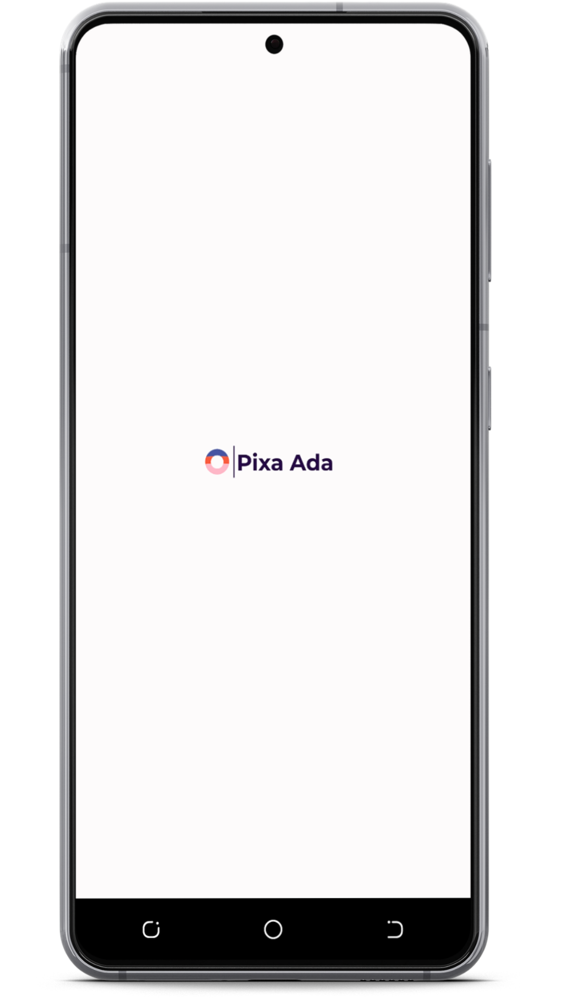
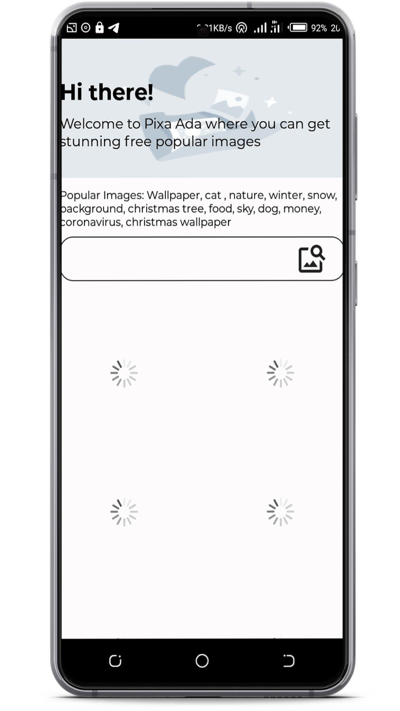
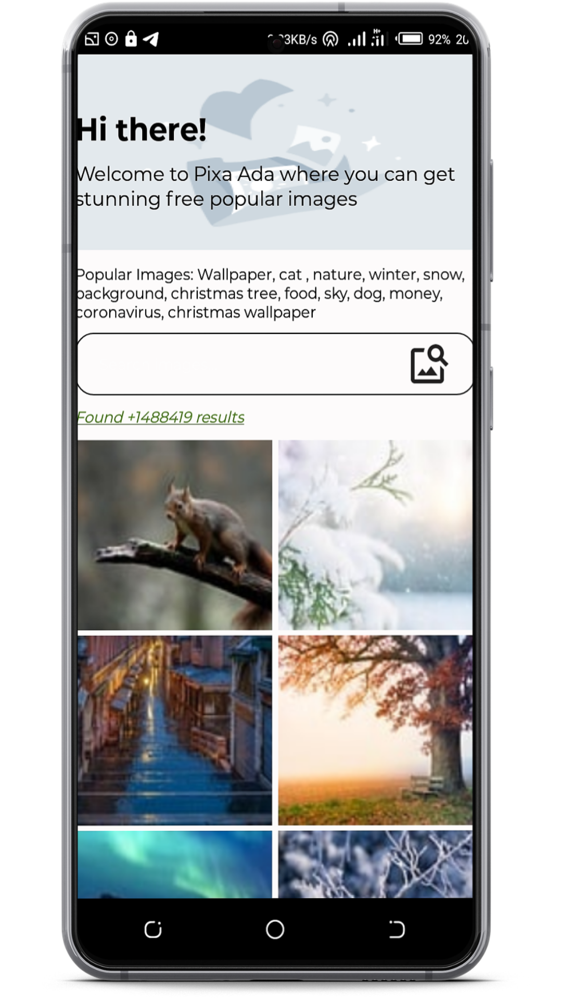
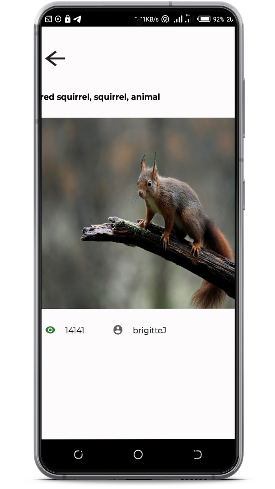
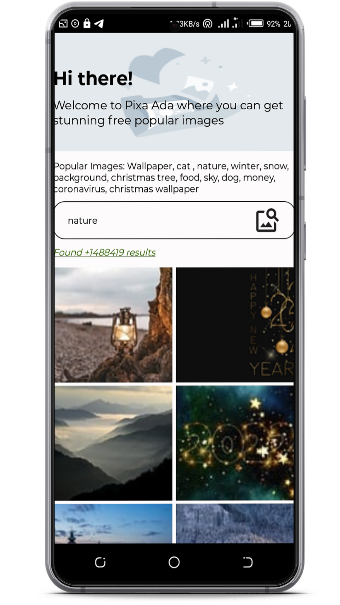

# Pixa Ada Android Application.

## Features.
1. Search
2. Image Gallery.

## Download apk
[APK](https://play.google.com/store/apps/details?id=com.intoverflown.sasakazi)

## Architecture.
* **ViewModel:** *Stores UI-related data that isn't destroyed on app rotations*.
* **LiveData:** *To build data objects that notify views when the underlying database changes in an active lifecycle state.*
* **MVVM architecture:** *Model-View-ViewModel architecture design pattern is a solution that is capable of adapting to different sort of user-driven workflows and tasks.*
* 

## Libraries.
[Retrofit](https://square.github.io/retrofit/) - A `REST` Client for Java and Android. It makes it relatively easy to retrieve and upload `JSON` (or other structured data) via a *REST based webservice*. In Retrofit you configure which converter is used for the data serialization. 
[Glide](https://github.com/bumptech/glide) - Glide is a fast and efficient open source media management and image loading framework for Android that wraps media decoding, memory and disk caching. 
[Kotlin Coroutines](https://kotlinlang.org/docs/coroutines-guide.html) - Coroutines are computer program components that *generalize subroutines for non-preemptive multitasking*, by allowing execution to be suspended and resumed. I used coroutines because they're well-suited for implementing familiar program components such as *cooperative tasks, exceptions, event loops, iterators, infinite lists and pipes*. 
[Data Binding](https://developer.android.com/topic/libraries/data-binding) - I used this to bind UI components in our layouts to data sources in our app using a declarative format rather than programmatically.

## Screenshots.

